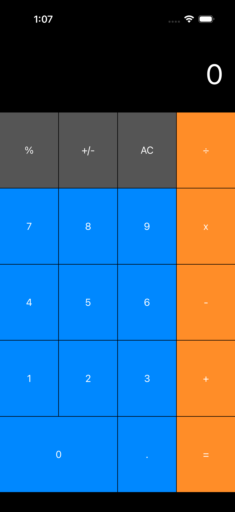

# README.md

## Calculator View

A sample Calculator view using auto layout in storyboard

This project demonstrates a simple calculator interface built using Auto Layout in a storyboard. The layout is designed to be responsive and adapt to different screen sizes and orientations.

### Screenshot



### Features

- Basic calculator layout with buttons for digits and operations
- Responsive design using Auto Layout constraints
- Easy to modify and extend for additional functionality

### Requirements

- Xcode 12 or later
- iOS 14.0 or later

### Installation

1. Clone the repository:

   ```bash
   git clone https://github.com/musahibrahimali/StoryBoardCalculator.git
    ```

2. Open the project in Xcode:

    ```bash
    cd StoryBoardCalculator
    open StoryBoardCalculator.xcodeproj
    ```

3. Build and run the project on a simulator or device.
